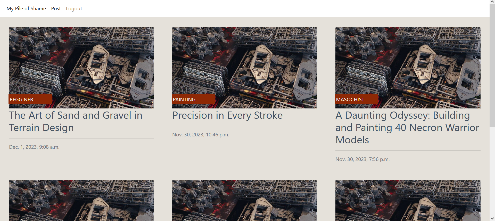
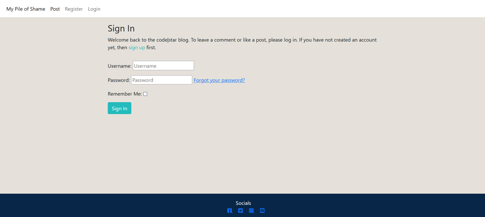
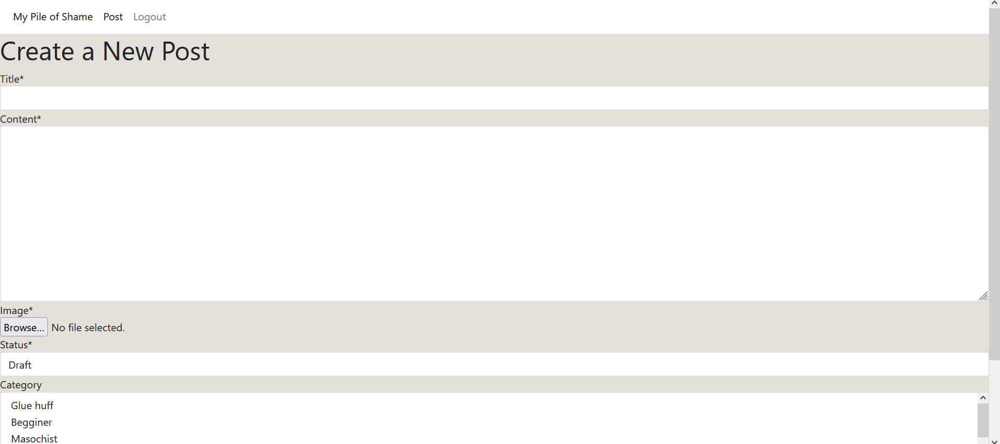
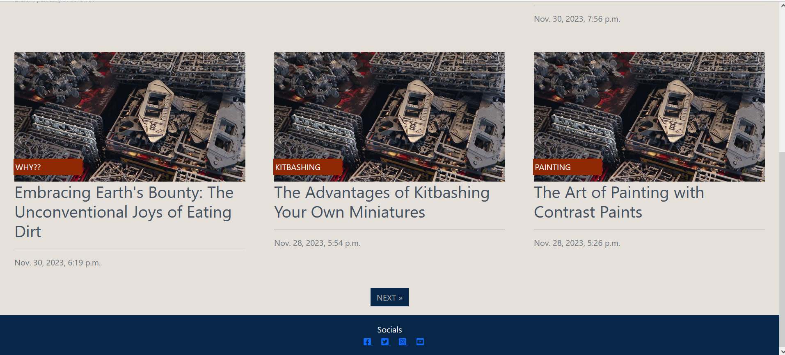

<h1 align="center">My Pile of Shame</h1>

[Link to website here](https://my-pile-of-shame-43d33f4851bf.herokuapp.com/)

This is a personal blog meant to work as a hobby diary. Its main use is to document and organize my progress in an easy to show and share manner as I try different projects.
The meaning of “Pile of Shame” refers to a hobby that has got out of hand. An example would be someone who has a collection of unplayed Video games, or it would be clothes that were bought but never worn. For a miniature painter, it would be the pile of unpainted miniatures.
The main reasons to build this site are that I started collecting a couple of years ago and even though I managed to build and paint a good amount, the boxes have started to pile up, and I think a tool like this could help organize my hobby. Another reason would be that a close group of friends got into the hobby at the same time, and we have been sharing our progress through pictures and anecdotes, so having a site to share on this hobby seems more practical.  And lastly, even through I have the finished miniatures on display on a little box, the fact is that the techniques and methods I used to build and paint are slowly getting lost to me and I would like to document them.

## __User Experience (UX)__

-   ### ***User stories***

    -   #### First Time Visitor Goals

        1. As a First Tiem Visitor I can sign up for an account so that I can create posts and comments.

    -   #### Returning Visitor Goals

        1. As a Returning Visitor I can sign up for an account so that I can create posts and comments.
        2. As a Returning Visitor I can login to an account so that I can create posts and comments as a returning user.
        3. As a Returning Visitor I can logout of an account so that I remove access to anyone else using the computer

    -   #### Frequent User Goals

        1. As a Frequent User (Site Admin) I can create, edit and delete posts and comments.

-   ### ***Design***
    
    -   #### Colour Palette

        - The colour palette is made up of four colours: 
          - #b7b1b1
          - Halite Blue #082647
          - Dark red #8e2805
          - Black #000000
          - White #FFFFFF

## __Features__

### ***Existing Features***

- #### Navigation Bar

  - The navigation bar includes various clickable links, signup, login and logout functionality which changes according to the status of the user.   

  - The navigation bar was created with HTML and CSS  and is fully responsive across devices.

- #### Homepage

  

  - The homepage is where the user first lands and it shows a list of posts in order of latest to oldest created. 

- #### Signup Page

  

  - The Signup page consists of a form to be completed in order to sign up and create an account.

  - The form includes warning and error messages on input, ensuring the user is always informed about required or incorrect input.

  - Once a user has signed up, they are informed via a message alert at the top of the page, which they can close at their convenience.

- #### Login Page

  

  - The Login page consists of a form to be completed in order to login to an existing account.

  - The form includes warning and error messages on input, ensuring the user is always informed about required or incorrect input.

  - Once a user has logged in, they are informed via a message alert at the top of the page, which they can close at their convenience.

- #### Create new post

  

- #### Footer

  

  - The footer appears in the same format on all pages this allows for consistency throughout the site.
  - It contains social media links.
  - The footer was created with HTML and CSS only and is fully responsive across devices.

### ***Future Implementations***

- #### General

  - Add in the possibility to add images to posts to add visual information to the subject.

  - Create a polls' system to interact with users and organize events.

  - Improve the Lighthouse Performance score across devices.

## __Technologies Used__

### ***Languages Used***

-   [HTML5](https://en.wikipedia.org/wiki/HTML5)

-   [CSS3](https://en.wikipedia.org/wiki/Cascading_Style_Sheets)

-   [JavaScript](https://en.wikipedia.org/wiki/JavaScript)

-   [Python](https://en.wikipedia.org/wiki/Python_(programming_language))

### ***Frameworks, Libraries & Programs Used***

1. [Django:](https://www.djangoproject.com/)
    - The Django web framework was used to create the full-stack web application.

1. [PostgreSQL:](https://en.wikipedia.org/wiki/PostgreSQL)
    - PostgreSQL was used as the object-relational database system.

1. [ElephantSQL:](https://www.elephantsql.com/)
    - ElephantSQL was used to host the database.

1. [Git:](https://git-scm.com/)
    - Git was used for version control by utilizing the Gitpod terminal to commit to Git and Push to GitHub.

1. [GitHub:](https://github.com/)
    - GitHub is used to store the projects code after being pushed from Git.

1. [Heroku:](https://heroku.com/)
    - Heroku was used for the deployed application.

1. [Chrome DevTools:](https://developer.chrome.com/docs/devtools/)
    - Chrome DevTools was used to consistently check the site in terms of responsivity, performance, accessibility, best practice and SEO.

1. [Google Fonts:](https://fonts.google.com/)
    - Google Fonts was used to import the ''Orelega One' and 'Poppins' fonts into the style.css file which is used on all pages throughout the project. [Orelega One](https://fonts.google.com/specimen/Orelega+One?query=orelega) for the headings and [Poppins](https://fonts.google.com/specimen/Poppins?query=poppins) is used for the remaining text.

1. [Font Awesome:](https://fontawesome.com/)
    - Font Awesome was used on all pages throughout the website to add icons for aesthetic and UX purposes.

## __Testing__

### ***HTML, CSS , JavaScript and Python Testing***

-   [W3C Markup Validator](https://jigsaw.w3.org/css-validator/#validate_by_input) was used to validate every page of the project to ensure there were no HTML or Css syntax errors in the project.

### ***Manual Testing***

- Manual testing was performed app-wide to ensure a smooth and positive user experience. 

- Consistent testing was carried out to ensure there was a logical flow when using the app, and that user's expectations for where links would take them, and what would follow user actions were respected.

**TEST** | **ACTION** | **EXPECTATION** | **RESULT** 
----------|----------|----------|----------
Home page	| Size to 320px using Chrome Dev Tools	| Elements look good @ 320px | Works as expected
Home page	| Size to 1920px using Chrome Dev Tools | Elements look good 1920px | Works as expected
Contact form | Click send button without data in form fields | Cannot submit form | Works as expected
Nav bar - home page | Click nav buttons | That each nav element takes me to the correct page site page | Works as expected

## Deployment

### Heroku

1. Navigate to your Heroku dashboard
2. Click "New" and select "Create new app".  

3. Input a meaningful name for your app and choose the region best suited to your location.  

4. Select "Settings" from the tabs.  
 
5. Click "Reveal Config Vars".  

6. Input all key-value pairs as necessary from the `.env` file. **Ensure DEBUG
   and DEVELOPMENT are not included**.

7. Click "Add buildpack".  

8. Add "python" from the list or search if necessary, remember to
 click save.  

9. Select "Deploy" from the tabs.  

10. Select "GitHub - Connect to GitHub" from deployment methods.  

11. Click "Connect to GitHub" in the created section. 

12. Search for the GitHub repository by name.  
13. Click to connect to the relevant repo.
14. Either click `Enable Automatic Deploys` for automatic deploys or `Deploy
 Branch` to deploy manually. Manually deployed branches will need
 re-deploying each time the repo is updated.  

15. Click `View` to view the deployed site.  

16. The live site can also be accessed from your repo in GitHub from the
    environments section of the repo.

The site is now live and operational

## __Credits__

### ***Code***

- The following were used as references to help with writing the HTML, CSS, JavaScript and Python code:
  - [Code Institute LMS](https://learn.codeinstitute.net/ci_program/diplomainsoftwaredevelopmentecommerce), in particular the [CI I Think Therefore I Blog Walkthrough](https://learn.codeinstitute.net/courses/course-v1:CodeInstitute+FST101+2021_T1/courseware/b31493372e764469823578613d11036b/fe4299adcd6743328183aab4e7ec5d13/)
  - [W3Schools](https://www.w3schools.com/) 
  - [Stack Overflow](https://stackoverflow.com/)
  - [MDN Web Docs](https://developer.mozilla.org/en-US/)
  - [Django Documentation](https://docs.djangoproject.com/en/4.1/)

### ***Content***

- The sites current content was made with chatGPT to fill up the posts and populate the website with quick content.

### ***Media***

- The two default images images were taken from:

  - [Homepage post card Image](https://www.youtube.com/watch?v=uiKDtmyY5Hk) by [Midwinter Minis](https://www.youtube.com/@MidwinterMinis)

  - [Post detail image](https://frontlinegaming.org/2019/12/07/i-got-an-airbrush-and-you-should-too/)

### ***Acknowledgements***

Massive thanks to: 

- My mentor, Tutor Support, Student Care and the Slack Community at [Code Institute](https://codeinstitute.net/global/) for their support.
